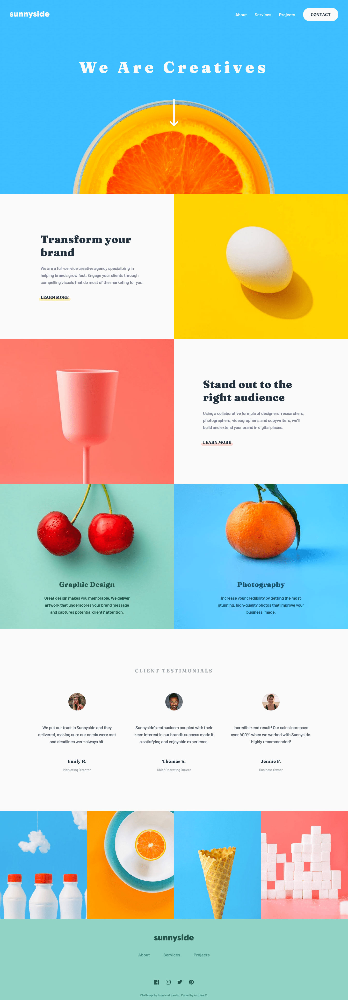
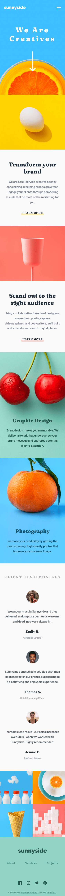

# Frontend Mentor - Sunnyside agency landing page solution

This is a solution to the [Sunnyside agency landing page challenge on Frontend Mentor](https://www.frontendmentor.io/challenges/sunnyside-agency-landing-page-7yVs3B6ef).

## Table of contents

- [Overview](#overview)
  - [The challenge](#the-challenge)
  - [Screenshot](#screenshot)
  - [Links](#links)
- [My process](#my-process)
  - [Built with](#built-with)
  - [What I learned](#what-i-learned)
  - [Continued development](#continued-development)
  - [Useful resources](#useful-resources)
- [Author](#author)

## Overview

### The challenge

Users should be able to:

- View the optimal layout for the site depending on their device's screen size
- See hover states for all interactive elements on the page

### Screenshot

- Desktop (1440x800)



- Mobile (375x760)



### Links

- Solution URL: [https://www.frontendmentor.io/solutions/sunnyside-agency-landing-page-html-css-ts-JzhDFPWBf6](https://www.frontendmentor.io/solutions/sunnyside-agency-landing-page-html-css-ts-JzhDFPWBf6)
- Live Site URL: [https://sunnyside-agency-landing-page-ivory.vercel.app/](https://sunnyside-agency-landing-page-ivory.vercel.app/)

## My process

### Built with

- Semantic HTML5 markup
- CSS custom properties
- CSS Grid
- CSS Flexbox
- Mobile-first workflow
- [SASS/SCSS](https://sass-lang.com/)
- [Typescript](https://www.typescriptlang.org/)
- [Vitejs](https://vitejs.dev/)

### What I learned

#### General feelings

This project was pretty much a CSS challenge. The only javascript is for the mobile menu.

I chose this one thinking "I am going to chill with a Junior Project" and let me say it: **It was not easy**.

Many hard choices especially with the images! I chose to add them in the markup instead of using the CSS background-image because it seems to me that they are as important as the rest of the content.

Also many absolute positioning.

#### HTML Picture tag

I had already worked with the srcset attribute of images but this time i was not happy with it because of the fact that on mobile device with a high dpi (3x or 4x) some images would switch to there desktop version breaking the layout.

I used the `<picture></picture>` tag instead which gives much more control over the breakpoints etc...

```html
<picture>
  <source media="(max-width: 649px)" srcset="./src/assets/mobile/image-header.jpg" />
  
</picture>
```

### Continued development

I am not really pleased with the current layout above 1440px. The images are not wide enough for this, so it gets really pixelated.

I can't really add a max-width to the whole thing tho it does not look like this type of layout.

If you think about a solution feel free to share! 😄

### Useful resources

- [Vitejs](https://vitejs.dev/) - Js Dev server & code bundler.
- [Utopia](https://utopia.fyi/) - Elegantly scale type and space without breakpoints.
- [PXtoEM Converter](https://www.w3schools.com/tags/ref_pxtoemconversion.asp) - This tool allows you to work out the em sizes from pixels (or vice versa).

## Author

- Frontend Mentor - [@AntoineC-dev](https://www.frontendmentor.io/profile/AntoineC-dev)
